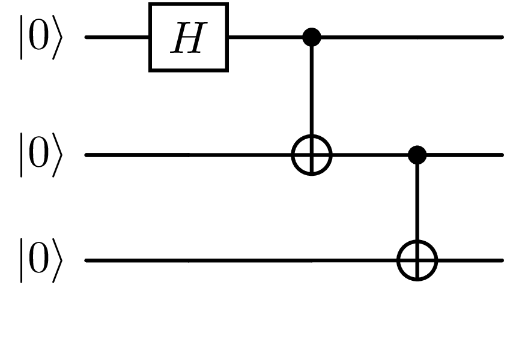
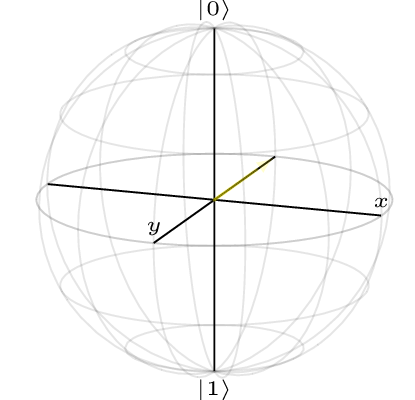

<div align="center">

# QSLD

## Quantum Simulation Library in D

</div>

### Introduction

QSLD is a quantum simulation library, mainly for my own benefit in learning more about quantum computing and the technical details behind what is happening at a mathematical level and also to learn the D programming language. The library should be used at your own risk knowing that it is not optimized to the maximum extent nor is it intended to be super production ready. If you would like to use a quantum simulation library which is production ready and optimized please use Qiskit instead of QSLD. I will provide ample documentation for anyone who would like to use this library for recreational purposes. To access it, refer to the wiki (not available yet). This library embraces the idea of simplicity and therefore you will have to build the entire library from scratch into a dynamically linked library file to then link with your main D program. Instructions for doing all of this are below.

### Dependencies For Building

- `dmd` or `gdc` or `ldc2`
- `rdmd`
- `pdflatex` (optional*)
- `quantikz` (optional*)

`pdflatex` and `quantikz` are optional only if you do not want to draw the circuits you create with this library. Otherwise, at least `quantikz` is an absolute necessity, `pdflatex` can be replaced with another latex compiler.

### Building

Before building, clone the project and cd into the root.

If you are using dmd and do not want to compile any examples in the `examples/` directory, You may use the following command:

```console
$ ./build.d 
```
If you are using another compiler (i.e. gdc or ldc2), you must specify the compiler name like so:

```console
$ ./build.d -c gdc
```
If you would like to compile an example, you must specify an example name to compile:

```console
$ ./build.d -e example_name
```
you can also do multiple in a row:

```console
$ ./build.d -e example_name1 -e example_name2
```

### Linking

To link the `libqsld.a` file with your main D program, either put it in a global directory for libraries like `/usr/local/lib` or `/usr/lib` and use the following command:

```console
$ <compiler-name> -L="-lqsld" -of=<bin-name> <d-filename>.d
```

or keep it in the root of the project and use the following:

```console
$ <compiler-name> -L-L/path/to/project/libsqld.a -L="-lqsld" -of=<bin-name> <d-filename>.d

```

Linking with any of the examples in `examples/` will be done **automatically** by `build.d`.

### Cleanup

If you would like to cleanup all of the compiled files generated after compilation, you can do:

```console
$ ./build.d -d
```

**Note** this will delete `libqsld.a` and any object or binary files related to the examples.

### Circuit Visualizations

If you would like to be able to visualize the circuits you create with this library. Then you must have some latex compiler installed, it is recommended that if you are going to use this feature to always have the default compiler `pdflatex` installed just in case. Also, you will need a latex package called `quantikz` which must be installed manually onto your system. If you would like to learn how to use this feature in more detail, please refer to the wiki (not available yet).

#### Installing `quantikz`

In order to install quantikz, you must download the file `quantikz.sty` from this [website](https://ctan.org/pkg/quantikz). Once you have downloaded the file and unzipped the archive, you should move it to a global directory where the latex compiler will recognize it, typically this will be `/usr/local/share/texmf/tex/latex/quantikz/`. You should create this directory with root priveleges if it does not exist:

```console
$ sudo mkdir -p /usr/local/share/texmf/tex/latex/quantikz/
```

Once this is done you should move **just** the `quantikz.sty` file to that directory with root priveleges.

### Bloch Sphere Visualization

In order to be able to create bloch sphere visualizations for a given qubit, you will need to install the `blochsphere` latex package. In order to do this, the easiest way is to install a tool for installing Latex packages called `tlmgr`. In order to install this utility you will need a TexLive infastructure package(s). For **Arch Linux** you should install `texlive-core` and for **Debian/Ubuntu** you should install both `texlive-base` and `texlive-full`. If you are on another Operating System, then I am not familiar on how to install these packages, therefore support is limited if not non-existent. However, if you have installed the packages then you should run:

```console
$ tlmgr install blochsphere
```

to install the blochsphere package. See instructions below on how to test if the installation worked.

## Features

- `state vector simulation`
- `density matrix simulation`
- `observable application`
- `expectation value calculation`
- `gate noise`
- `decoherence (T1/T2 decay)`
- `algorithm implementations (Deutsch-Jozsa, BBB84, Quantum Teleportation, Grovers, Shors)`
- `quantum machine learning`
- `circuit visualizations`
- `bloch sphere visualization`
- `custom unitaries`

## Getting Started

Writting your first quantum circuit with QSLD is easy

```d
import std.stdio;
import quantum.pure_state.qc;

void main() {
    QuantumCircuit qc = QuantumCircuit(3);

    // Make a 3 qubit GHZ state
    qc.hadamard(0);
    qc.cnot(0, 1);
    qc.cnot(1, 2);

    writeln("Final quantum state: ", qc.state.elems);
}
```

You can see more simple and complex examples in the `examples/` directory.

### Drawing The Circuit

In order to draw the circuit above you just add one line to it:

```d
import std.stdio;
import quantum.pure_state.qc;

void main() {
    QuantumCircuit qc = QuantumCircuit(3);

    // Make a 3 qubit GHZ state
    qc.hadamard(0);
    qc.cnot(0, 1);
    qc.cnot(1, 2);
    qc.draw();

    writeln("Final quantum state: ", qc.state.elems);
}
```

The filename of the generated file is `circuit.pdf`.

The image generated is:



### Drawing The Bloch Sphere

In order to draw the bloch sphere of a given qubit you can do:

```d
    import quantum.pure_state.qc;
    import viz.bloch_sphere.pure_state.bloch_sphere;

    void main() {
        QuantumCircuit qc = QuantumCircuit(1);
        qc.hadamard(0);
        qc.s(0);
        qc.pauli_z(0);

        BlochSphere bs = BlochSphere(&qc);
        bs.draw_bloch_sphere(0);
    }
```

The filename of the generated file is `qubitX_bloch.pdf` where X is the qubit number you drew.

The image generated is:




